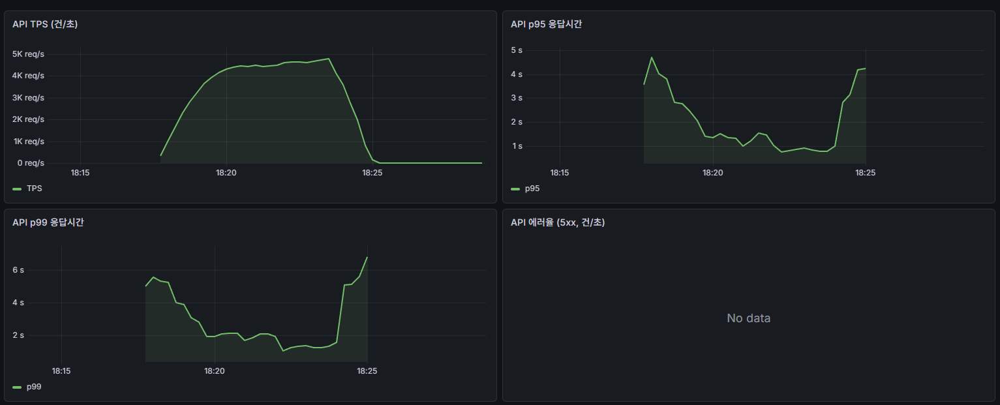
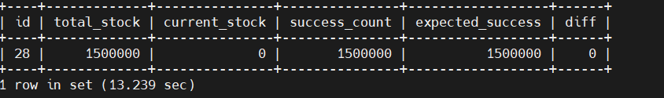
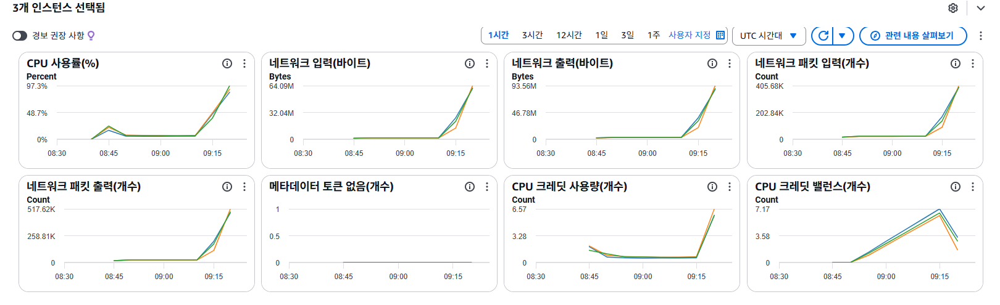
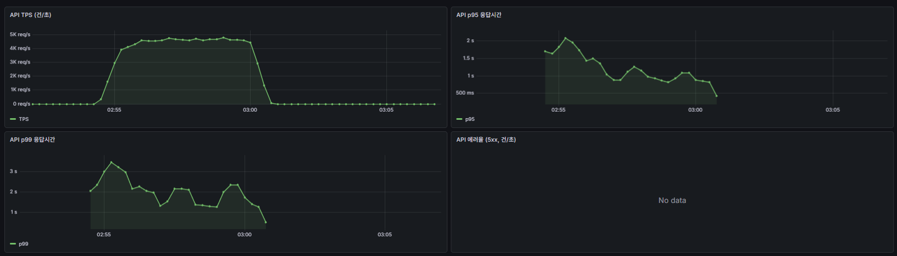
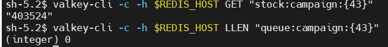
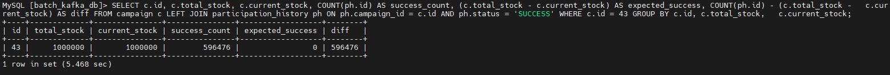
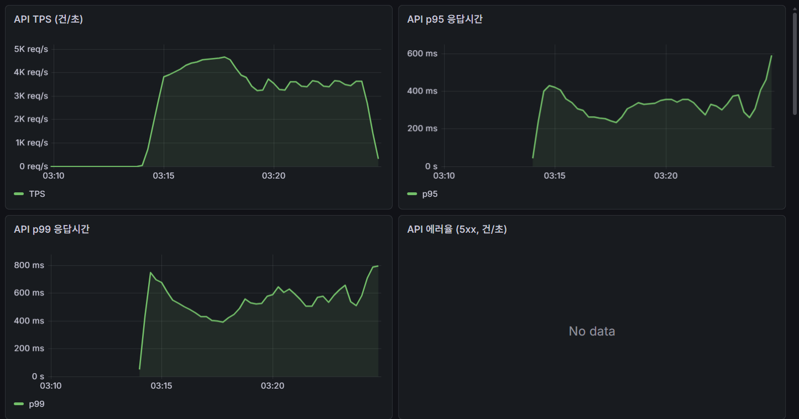
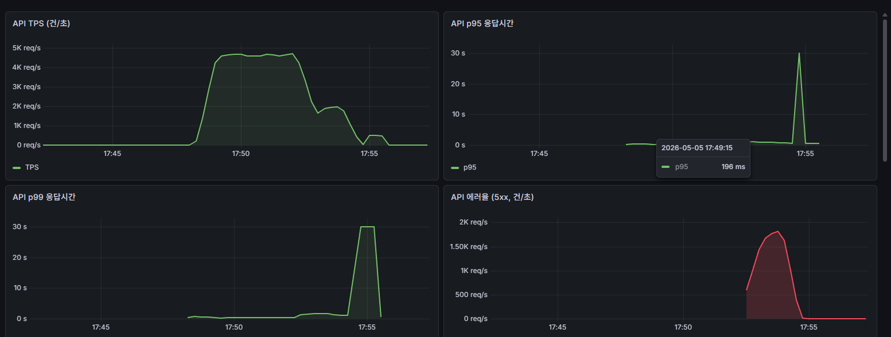
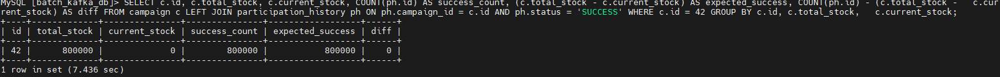
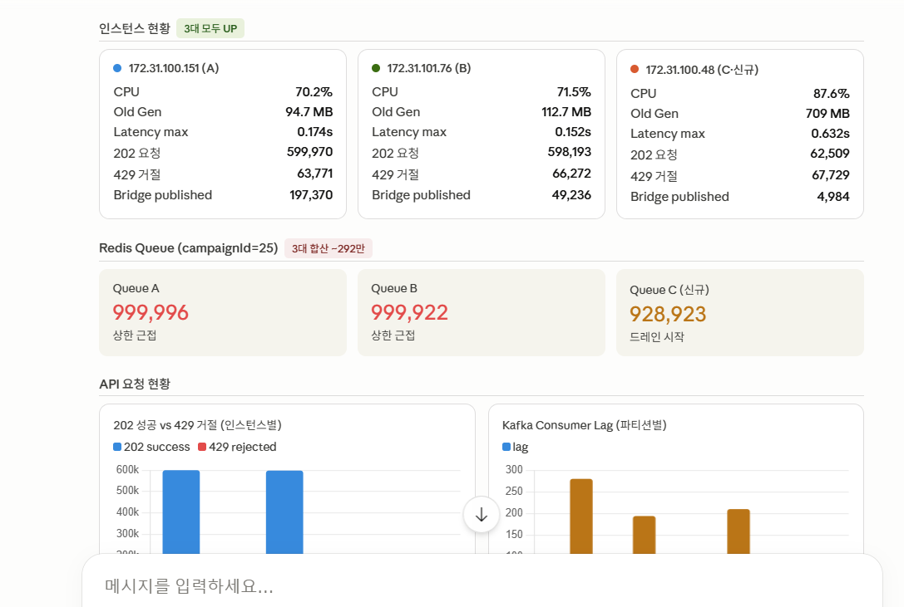

# 1Million Campaign Orchestration System

> **150만 트래픽 선착순 이벤트 시스템 — 14차 반복 실험 + AI 자율 운영**
>
> *[event-driven-batch-kafka-system (v1, 10만 트래픽)](https://github.com/hskhsmm/event-driven-batch-kafka-system) 의 확장 프로젝트입니다.*

[](https://openjdk.org/)
[](https://spring.io/projects/spring-boot)
[](https://kafka.apache.org/)
[](https://aws.amazon.com/elasticache/)
[](https://www.terraform.io/)
[](https://aws.amazon.com/)

---

## 목차

- [프로젝트 소개](#프로젝트-소개)
- [v1 vs v3 비교](#v1-vs-v3-비교)
- [전체 아키텍처](#전체-아키텍처)
- [핵심 설계 결정](#핵심-설계-결정)
- [부하 테스트 — 14차 반복 실험](#부하-테스트--14차-반복-실험)
- [핵심 문제 발견 및 해결](#핵심-문제-발견-및-해결)
- [장애 시나리오 테스트 T01~T07](#장애-시나리오-테스트-t01t07)
- [인프라 구성](#인프라-구성)
- [모니터링](#모니터링)
- [CI/CD 파이프라인](#cicd-파이프라인)
- [Tech Stack](#tech-stack)
- [Author](#author)

---

## 프로젝트 소개

### 왜 이 프로젝트인가

v1(10만 트래픽)에서 Kafka 파티션 수에 따른 처리량 vs 공정성 트레이드오프를 실험으로 증명했습니다.
v3는 한 가지 질문으로 시작했습니다.

> **"v1 구조로 150만 트래픽을 정합성 보장 하에 처리할 수 있는가?"**

답은 No였습니다. v1은 API 응답 경로에 DB가 있어 HikariCP pending이 980까지 쌓였고,
구조적 전환 없이는 스케일아웃도 의미가 없었습니다.

### 해결 방향

단순한 스케일업이 아닌 세 방향으로 고도화했습니다.

| 방향 | 내용 |
|------|------|
| **구조적 전환** | API 응답 경로에서 DB 완전 제거 → Redis-first v3 |
| **인프라 코드화** | 전체 AWS 인프라를 Terraform으로 관리 |
| **AI 자율 운영** | MCP 서버로 Prometheus/CloudWatch 30초 폴링 + Slack 알림 |

### 최종 결과

| 지표 | 값 |
|------|----|
| 평균 TPS | **~3,737/s** |
| 피크 TPS | **~4,800/s** |
| 총 처리 정합성 | **1,500,000건 (diff=0)** |
| 5xx 에러 | **0건** |
| v1 대비 TPS 향상 | **246 → 3,737 (약 15배)** |
| 장애 테스트 | **T01~T07 전체 통과** |

---

## v1 vs v3 비교

| 항목 | v1 (10만 트래픽) | v3 (150만 트래픽) |
|------|-----------------|------------------|
| 목표 트래픽 | 10만 건 | **150만 건** |
| API 응답 경로 | Redis DECR → **DB PENDING INSERT** → LPUSH | Redis DECR → LPUSH → 202 (**DB 미접촉**) |
| HikariCP pending | ~980 (병목) | **거의 0** |
| TPS (DB 커밋 기준) | 278~595/s | **~3,737/s** |
| Redis | ElastiCache 단일 | **ElastiCache CME 3샤드** |
| Kafka | EC2 단일 브로커 | **EC2 3-broker KRaft 클러스터** |
| 앱 서버 | 단일 EC2 | **ASG (min=2, max=3)** |
| 인프라 관리 | 수동 콘솔 | **Terraform IaC** |
| 배포 | GitHub Actions + CodeDeploy | **OIDC + ECR + CodeDeploy** |
| 모니터링 | 웹 대시보드 (자체 구현) | **Prometheus + Grafana 16패널 + MCP 서버** |
| 장애 테스트 | 없음 | **T01~T07 전체 통과** |

---

## 전체 아키텍처


```
[클라이언트 160만 요청]
         |
         | POST /api/campaigns/{id}/participation
         v
[ALB — alb-batch-kafka-api]
         |
         v
[Spring Boot App — ASG (t3.small × 2~3대)]
         |
         |-- 1. RateLimitService   SET NX EX 10  (10초 내 중복 요청 차단)
         |-- 2. Redis Lua          단일 원자 실행 (check-decr-enqueue.lua)
         |        ├─ active 플래그 체크       → -999: 비활성 캠페인
         |        ├─ participated 키 체크     → -997: 중복 참여 차단 (영구)
         |        ├─ Queue 크기 체크          → -998: 만원 시 429 (DECR 미실행)
         |        ├─ DECR (재고 차감)
         |        ├─ LPUSH (Queue 적재)
         |        └─ SET participated (참여 이력)
         |-- 202 반환 (DB 미접촉)
         v
[ElastiCache CME — Valkey 7.2, 3샤드]
  stock:campaign:{id}   ← 재고 (DECR)
  queue:campaign:{id}   ← API→Bridge 버퍼
  participated:...      ← 중복 참여 방지
         |
         v
[ParticipationBridge — @Scheduled 100ms]
  SMEMBERS active:campaigns
  RPOP queue:campaign:{id}  (동적 batchSize: 500/1000/2000)
  Kafka publish (userId 파티션 키)
         |
         v
[Kafka — campaign-participation-topic]
  파티션 10개 / RF=3 / min.ISR=2
  3-broker KRaft 클러스터
         |
         v
[ParticipationEventConsumer — concurrency 파티션 수 자동 감지 (파티션 10개 = concurrency 10)]
  jdbcTemplate.batchUpdate() INSERT IGNORE
  배치 실패 시 단건 폴백 + DLQ
         |
         v
[MySQL RDS — batch-kafka-db]
  participation_history (campaign_id, user_id, sequence)
  UNIQUE KEY uq_campaign_user (멱등성 보장)
```

### 선착순 번호 확정 시점

```
sequence = totalStock - remaining   (Redis DECR 시점에 원자적으로 확정)
```

API 진입 시 DECR 한 번으로 선착순 번호가 확정됩니다.
Kafka 파티션이 10개여도 공정성이 깨지지 않는 이유입니다.

---

## 핵심 설계 결정

### 1. Redis Lua 단일 원자화 — check-decr-enqueue.lua

v1에서 재고 차감과 큐 적재가 분리된 두 번의 연산이었다면,
v3에서는 5개 연산이 단일 Lua 스크립트로 원자 실행됩니다.

```lua
-- KEYS[1] = active:campaign:{id}      KEYS[4] = queue:campaign:{id}
-- KEYS[2] = stock:campaign:{id}       KEYS[5] = participated:campaign:{id}:user:{userId}
-- KEYS[3] = total:campaign:{id}       ARGV[1] = maxQueueSize

if redis.call('EXISTS', KEYS[1]) == 0 then
    return {-999, 0}   -- 비활성 캠페인
end
if redis.call('EXISTS', KEYS[5]) == 1 then
    return {-997, 0}   -- 중복 참여 (영구 차단)
end
if tonumber(redis.call('LLEN', KEYS[4])) >= tonumber(ARGV[1]) then
    return {-998, 0}   -- Queue 만원 → DECR 미실행 (partial failure 차단)
end
local remaining = redis.call('DECR', KEYS[2])
if remaining < 0 then return {remaining, 0} end
if remaining == 0 then redis.call('DEL', KEYS[1]) end
local total = tonumber(redis.call('GET', KEYS[3])) or 0
local sequence = total - remaining
local message = '{"campaignId":' .. ARGV[2] .. ',"userId":' .. ARGV[3] .. ',"sequence":' .. sequence .. '}'
redis.call('LPUSH', KEYS[4], message)
redis.call('SET', KEYS[5], '1')
return {remaining, total}
```

**원자화의 핵심 효과**: Queue가 가득 찼을 때 DECR 자체를 실행하지 않습니다.
기존에는 DECR 후 LPUSH 실패 시 재고는 차감됐는데 Queue엔 없는 partial failure가 발생했습니다.

### 2. ElastiCache CME 해시태그 설계

ElastiCache Cluster Mode Enabled(CME)에서 Lua 스크립트는 동일 슬롯의 키만 접근 가능합니다.
`{campaignId}` 해시태그로 5개 키를 동일 슬롯에 배치했습니다.

```
active:campaign:{13}      → 슬롯 X
stock:campaign:{13}       → 슬롯 X  (동일)
total:campaign:{13}       → 슬롯 X  (동일)
queue:campaign:{13}       → 슬롯 X  (동일)
participated:campaign:{13}:user:{userId} → 슬롯 X (동일)
```

### 3. Kafka Consumer 배치 INSERT

v1에서 Consumer가 메시지를 1건씩 INSERT하던 것을 batchUpdate로 전환했습니다.

```java
// DB 왕복 N→1: rewriteBatchedStatements=true
jdbcTemplate.batchUpdate(
    "INSERT IGNORE INTO participation_history (campaign_id, user_id, sequence, status, created_at) VALUES (?, ?, ?, 'SUCCESS', NOW())",
    batchArgs
);
```

| 항목 | 변경 전 | 변경 후 |
|------|--------|--------|
| DB 왕복 | N번 (건당 1회) | 1번 (배치) |
| Consumer 지연 | 200ms | **7.5ms** |
| Kafka lag | 9K 누적 | **거의 0** |

### 4. 파티션 키: campaignId → userId

6차 테스트에서 파티션 키를 campaignId에서 userId로 변경했습니다.

| 파티션 키 | Consumer 지연 | 이유 |
|---------|-------------|------|
| campaignId | 1.25s | 단일 캠페인 트래픽이 한 파티션으로 집중 |
| **userId** | **200ms** | 10개 파티션에 균등 분산 → Consumer 10개 병렬 처리 |

### 5. ASG 수평 확장 vs 스케일업

7~8차에서 앱 CPU 80~90% 고착 확인 후 스케일업(t3.xlarge) 대신 ASG를 선택했습니다.

| 비교 | 스케일업 (t3.xlarge) | ASG (t3.small × 2) |
|------|---------------------|-------------------|
| vCPU | 4개 | 4개 (동일) |
| 비용 | 4배 | **2배** |
| SPOF | 그대로 | **제거** |
| 탄력성 | 없음 | **Target Tracking** |

---

## 부하 테스트 — 14차 반복 실험

### 전체 결과 추이

| 차수 | 핵심 변경 | TPS | 정합성 | 비고 |
|------|----------|-----|--------|------|
| 1차 | 기준선 (pool=10) | 246/s | ✅ | HikariCP pending ~980 |
| 2차 | HikariCP pool=20 | 275/s | ✅ | pending ~950 |
| 3차 | pool=40 | 323/s | ✅ | pending ~900 |
| **4차** | **v3 Redis-first** | **526/s** | ✅ | **HikariCP pending 거의 0** |
| 5차 | 파티션 3개 (campaignId 키) | 543/s | ✅ | Consumer 지연 1.25s |
| 6차 | 파티션 3개 (userId 키) | 550/s | ✅ | Consumer 지연 200ms |
| 7차 | 3브로커+파티션 10개, 12만 | ~1,150/s | ✅ | 앱 CPU 80~90% |
| 8차 | 3브로커+파티션 10개, 50만 | ~1,220/s | ✅ | 앱 CPU 병목 확인 |
| **9차** | **ASG 2대**, 50만 | **~2,014/s** | ✅ | TPS +65% |
| 10차 | writeResultCache 제거 + 배치 INSERT, 100만 | ~2,613/s | ❌ | Queue 500K 오버플로우 425K 유실 |
| **11차** | **MAX_QUEUE_SIZE 1M**, 100만 | **~2,442/s** | **✅ 1,000,000** | 정합성 완벽 |
| 12차 | ASG 3대, 130만 | ~2,507/s | ❌ | Queue 1M 초과 → **141,062 유실** |
| **13차** | **Lua 원자화 + Queue 1.5M**, 150만 | **~3,747/s** | **✅ 1,500,000** | 정합성 완벽 |
| **14차** | 동일 조건 재현 검증 | **~3,737/s** | **✅ 1,500,000** | 앱 CPU 97% |

### 14차 테스트 상세 결과



| 지표 | 값 |
|------|----|
| 총 요청 | 1,600,000건 |
| 평균 TPS | ~3,737/s |
| 피크 TPS | ~4,800/s |
| avg 응답시간 | 746ms |
| p95 | 2.15s |
| 5xx 에러 | **0건** |
| DB COUNT | **1,500,000** |
| diff | **0** |

> **p95 2.15s는 의도된 결과입니다.**
> VUS=3,000은 t3.small 3대를 CPU 97%까지 포화시키는 **한계 측정 조건**입니다.
> 정상 운영 목표(CPU 50% 수준, VUS=1,500)에서는 응답시간이 현저히 낮아집니다.
> 이 테스트의 목적은 레이턴시 최적화가 아니라 "시스템이 물리적 한계에서도 정합성을 지키는가"의 검증입니다.



### ASG 3대 CPU 97%

TPS 3,737/s는 t3.small 3대를 CPU 97%까지 포화시키는 수치입니다.
서버 스펙이 커지면 더 높은 TPS 달성 가능 (ASG 추가 스케일아웃 필요 지점 확인).



### VUS 최적화 인사이트

**TPS = VUS / 응답시간 (Little's Law)** — VUS가 높다고 무조건 TPS가 높아지지 않습니다.

| VUS | avg 응답시간 | p95 | TPS | CPU | 용도 |
|-----|------------|-----|-----|-----|------|
| 500 | ~15ms | — | ~1,300 | ~30% | 장애 테스트 부하 유지 |
| **1,500** | **~300ms** | — | **~2,500** | **~50%** | **★ 권장 운영 지점** |
| 3,000 | ~746ms | **2.15s** | ~3,737 | ~97% | 최대 한계 측정 (의도적 과부하) |

- **권장 운영 지점은 VUS=1,500**: CPU ~50%로 여유가 있어 스파이크 대응 가능, TPS ~2,500/s 안정적
- VUS=3,000의 p95 2.15s는 서버를 한계까지 밀어붙인 스트레스 테스트 결과 — 정상 운영 목표 수치가 아님
- 장애 테스트 적정 VUS: **500** (CPU 30% 수준으로 서버 여유 확보, Kafka lag/5xx 효과 명확히 관찰 가능)
- 안정 운영 조건 탐색: VUS 500→1,000→1,500→2,000 단계적으로 올리며 CPU 70% 이하 구간 확인

### 후단 처리량 관측 개선 및 150만 재검증

기존 TPS는 API가 `202 Accepted`를 반환하는 속도만 의미했습니다. 이 지표만으로는 Redis Queue 이후 Bridge, Kafka, Consumer, MySQL 저장 구간의 실제 처리량을 분리해서 보기 어려웠습니다.

이를 보완하기 위해 Consumer 단계에 Kafka poll, event parse, DB commit 지표를 추가했고, Grafana에서 API TPS와 후단 DB 반영 TPS를 함께 확인할 수 있도록 개선했습니다.

```text
API TPS
-> Bridge drain TPS
-> Kafka Consumer poll TPS
-> Consumer parsed event TPS
-> DB committed TPS
```

| 재검증 항목 | 결과 |
| --- | --- |
| 총 요청 | 1,500,000건 |
| API 평균 TPS | 약 4,500/s |
| 202 성공 | 1,500,000 / 1,500,000 |
| 5xx 실패 | 0건 |
| Bridge/Consumer 후단 peak | 약 5,500~6,000/s |
| Redis Queue 최대 적재 | 약 120만 건 |
| DB 일시 실패 | 0건 |





> 이번 재검증을 통해 API 접수 속도와 실제 DB 반영 속도를 분리해서 볼 수 있게 되었고, Redis Queue 적체가 유입량과 후단 처리량의 불균형에서 발생한다는 점을 수치로 확인했습니다.

### 병목 분석: HikariCP pending 해소

v3 전환(4차)의 핵심 효과는 API 응답 경로에서 DB를 완전히 제거한 것입니다.

```
v1(기존): API → Redis DECR → DB PENDING INSERT → LPUSH → 202
v3(개선): API → Redis DECR → LPUSH → 202  (DB 미접촉)
```

| 차수 | HikariCP pending | TPS |
|------|-----------------|-----|
| 1~3차 | ~980 | 246~323 |
| **4차 (v3)** | **거의 0** | **526** |

---

## 핵심 문제 발견 및 해결

### 문제 1 — Queue 오버플로우 데이터 유실 (10차)

**발견**: Queue 500K 상한 초과 시 LPUSH 실패해도 202 반환하는 구조적 문제.
재고는 차감됐는데 Queue에 없음 → DB에 도달 못함 → **425K 유실**.

**해결**: MAX_QUEUE_SIZE 1M 상향 → 11차 정합성 1,000,000 완벽.

---

### 문제 2 — DECR/LPUSH 비원자성 (12차 → 13차)

**발견**: 12차(ASG 3대, 130만 재고) — DB COUNT 1,158,938 → **141,062건 유실**.

| 원인 | 내용 |
|------|------|
| Queue 크기 부족 | MAX_QUEUE_SIZE=1M, 트래픽 초과 시 overflow |
| **비원자성** | Queue full 시 DECR은 됐지만 LPUSH 실패 → 202 반환했지만 DB에 없음, 복구 불가 |

```sql
-- 12차 vs 13차 정합성 비교
SELECT c.id, c.total_stock, c.status, COUNT(ph.id) AS success_count,
       c.total_stock - COUNT(ph.id) AS lost_count
FROM campaign c LEFT JOIN participation_history ph
  ON ph.campaign_id = c.id AND ph.status = 'SUCCESS'
WHERE c.id IN (24, 27) GROUP BY c.id, c.total_stock, c.status;
```

| id | total_stock | success_count | lost_count | |
|----|-------------|---------------|------------|---|
| 24 | 1,300,000 | 1,158,938 | **141,062** | 12차 (비원자적) |
| 27 | 1,500,000 | 1,500,000 | **0** | 13차 (원자화 후) ✅ |

**해결**: check-decr-enqueue.lua 단일 Lua 원자화
- Queue full 시 DECR 자체 미실행 → partial failure 원천 차단
- Redis 왕복 2회 → 1회 (성능 개선 부수효과)

> **주의**: 13차에서 Queue 최대 1.2M으로 1.5M 상한 미도달.
> 원자화 경로(queue full → 429 + 재고 차감 없음)의 실제 검증은 **T03 장애 테스트**에서 수행.

---

### 문제 3 — Redis 결과 캐시 CME 병목 (Consumer)

**발견**: writeResultCache(Redis pipeline) 사용 시 Kafka lag 9K 누적, Consumer 지연 200ms+.
ElastiCache CME에서 cross-slot pipeline 명령이 병목 원인.

**해결**: writeResultCache 완전 제거 → lag 거의 0, Consumer 지연 7.5ms.

---

### 문제 4 — 영구 중복 참여 버그 (T01 중 발견)

**발견**: RateLimitService TTL(10초) 만료 후 동일 userId 재요청 시 Redis stock 이중 차감.
DB UNIQUE 제약은 있었지만 재고 차감은 막지 못하는 구조적 허점.

**해결**: Lua 스크립트에 `participated:campaign:{id}:user:{userId}` 영구 키 추가.
LPUSH 성공 시 SET, 이후 요청은 EXISTS 체크로 -997 반환 → 409.

---

## 장애 시나리오 테스트 T01~T07

실제 AWS 환경에서 7개 시나리오 전체 검증 완료.

| # | 테스트 | 결과 | 핵심 확인 |
|---|--------|------|---------|
| T01 | 중복 요청 차단 | ✅ | 202→429→409 (TTL 만료 후 이중 차감 버그 발견 및 수정) |
| T02 | 재고 소진 400 | ✅ | diff=0, 재고 초과 판매 0건 |
| T03 | Queue 만원 429 | ✅ | Lua 원자화 경로 실제 검증 (Redis 잔여재고+DB=total_stock) |
| T04 | ConsistencyJob 복구 | ✅ | MISSING_REDIS_STOCK 감지 → restoreStock=20 복구 |
| T05 | Kafka 브로커 1대 장애 | ✅ | lag 스파이크→즉시 해소, 5xx 0건 |
| T06 | RDS 다운 → DLQ → 재처리 | ✅ | SG 3306 삭제/복구, 구조적 허점 2건 발견 및 수정 |
| T07 | ASG 인스턴스 1대 종료 | ✅ | TPS 80% 급락→3~4분 완전 복구, 5xx 0건, diff=0 |

### T03 — Queue 만원 원자화 검증

MAX_QUEUE_SIZE를 500K로 임시 축소 → Queue를 의도적으로 꽉 채움
→ 429 반환 + 재고 차감 없음 + Redis 잔여재고 + DB = total_stock 정합성 완벽 확인





### T05 — Kafka 브로커 1대 장애

VUS=500으로 부하 유지 중 브로커 1대 강제 종료.
RF=3, min.ISR=2 구성으로 브로커 1대 장애 시에도 쓰기 가능.



### T06 — RDS SG 삭제 장애 주입

RDS Security Group 3306 포트 삭제로 장애 주입 → 5xx 발생 → 복구 후 정상화.

**발견한 구조적 허점 2건:**
1. `remaining==0` 시 동기 DB 호출이 남아있어 RDS 장애 시 500 전파 → `try-catch`로 수정
2. `actuator/health`가 DB 상태를 포함 → ALB TG가 unhealthy 처리 → Redis-first API인데도 5xx 발생 (개선 포인트 — health indicator 커스터마이징으로 DB를 헬스체크 대상에서 제외하면 해결 가능하나, 이번 프로젝트 범위에서는 구조적 허점 문서화에 그침)

**자동 복구 확인**: Consumer `hasTransientFailure` ack 보류 → SG 복구 후 Kafka 재전달로 자동 재처리.



### T07 — ASG 인스턴스 1대 terminate

인스턴스 terminate → TPS 80% 급락 → ASG 자동 복구 → 3~4분 내 완전 복구.



| 지표 | 값 |
|------|----|
| TPS 복구 시간 | 3~4분 |
| 5xx 에러 | 0건 |
| DB diff | 0 |

---

## 인프라 구성

### AWS 아키텍처


```
VPC (172.31.0.0/16)
├── 퍼블릭 서브넷
│   ├── public_2a — kafka-1 (t3.small), terraform-mcp (t3.large)
│   ├── public_2b — kafka-2 (t3.small)
│   └── public_2c — kafka-3 (t3.small)
│
├── 프라이빗 서브넷 (IGW 연결)
│   ├── private_app_2a — ASG 인스턴스 (t3.small)
│   └── private_app_2b — ASG 인스턴스 (t3.small, multi-AZ)
│
├── ALB (internet-facing)
│   └── Target Group → batch-kafka-app:8080
│
├── ASG (batch-kafka-app-asg)
│   ├── min=2, max=3
│   ├── Target Tracking: CPU 60% (scale-in 비활성)
│   └── CodeDeploy OneAtATime 순차 배포
│
├── ElastiCache CME (Valkey 7.2)
│   ├── 샤드 1: primary + replica (cache.t3.micro)
│   ├── 샤드 2: primary + replica (cache.t3.micro)
│   └── 샤드 3: primary + replica (cache.t3.micro)
│
└── RDS (MySQL 8.0.44, db.t3.micro)
```

### Terraform 구성

전체 AWS 인프라를 Terraform으로 코드화했습니다.

| 파일 | 관리 리소스 |
|------|------------|
| `main.tf` | Provider, S3 backend, DynamoDB lock |
| `vpc.tf` | VPC, IGW, Subnets, Route Tables |
| `security_groups.tf` | ALB/App/RDS/Kafka/ElastiCache SG |
| `ec2.tf` | IAM Role/Profile/Policy, kafka-1/2/3, terraform-mcp |
| `asg.tf` | Launch Template, ASG, Target Tracking Scaling Policy |
| `codedeploy.tf` | CodeDeploy App/DG, Service Role (ASG 연결) |
| `rds.tf` | RDS 인스턴스, 파라미터 그룹 (slow query) |
| `elasticache.tf` | ElastiCache CME 3샤드, SSM 자동 등록 |
| `alb.tf` | ALB, Target Group, HTTP Listener |
| `iam.tf` | GitHub Actions OIDC Role |

**ElastiCache 생성 시 SSM 자동 등록:**
```hcl
resource "aws_ssm_parameter" "redis_cluster_nodes" {
  name  = "/batch-kafka/prod/SPRING_DATA_REDIS_CLUSTER_NODES"
  type  = "SecureString"
  value = "${aws_elasticache_replication_group.redis.configuration_endpoint_address}:6379"
}
```
`terraform apply` 한 번으로 ElastiCache 엔드포인트가 SSM에 자동 갱신됩니다.

### 보안 설계

| 항목 | 내용 |
|------|------|
| AWS 인증 | **OIDC** — GitHub Actions에 AWS Access Key 없음 |
| EC2 접속 | **SSM Session Manager** — SSH 22포트 완전 차단 |
| 시크릿 관리 | **SSM Parameter Store SecureString** (KMS 암호화) |
| 컨테이너 저장소 | **ECR Private** — 퍼블릭 노출 없음 |

---

## 모니터링

### Grafana 대시보드 (16패널)

```
terraform-mcp EC2
├── Prometheus :9090     ← Spring Boot :8080/actuator/prometheus
│                        ← kafka-exporter :9308
│                        ← redis-exporter :9121
├── Grafana :3000        ← 16패널 대시보드
└── mcp-server :8000     ← AI 운영 서버
```

| 패널 | 메트릭 |
|------|--------|
| API TPS | `rate(http_server_requests_seconds_count[1m])` |
| API p95/p99 응답시간 | `histogram_quantile(0.95/0.99, ...)` |
| API 에러율 (5xx) | `rate(...{status=~"5.."}[1m])` |
| Bridge 드레인 속도 | `rate(bridge_messages_published_total[1m])` |
| Redis Queue 적재량 | `redis_queue_size` (커스텀 Gauge) |
| Consumer PENDING→SUCCESS 지연 | `consumer_pending_to_success_latency_seconds` |
| Kafka Consumer Lag | `kafka_consumergroup_lag` |
| HikariCP 커넥션 풀 | `hikaricp_connections` |
| 앱 CPU 사용률 | `process_cpu_usage` |
| Consumer 후단 처리량 | `consumer_kafka_records_polled_total`, `consumer_events_parsed_total`, `consumer_db_committed_total` |
| Consumer DB 일시 실패율 | `consumer_db_transient_failures_total` |
| Consumer DB commit batch size | `consumer_db_commit_batch_size` |

**커스텀 메트릭 9종** (Micrometer 기반)
- `bridge.drain.duration` — Bridge drainQueues() 소요시간
- `bridge.messages.published` — Kafka 발행 성공 건수
- `consumer.pending_to_success.latency` — API → DB INSERT 지연
- `redis.queue.size` — Redis Queue 현재 적재량 (Gauge)
- `consumer.kafka.records.polled` — Kafka Consumer poll 건수
- `consumer.events.parsed` — 정상 payload 파싱 건수
- `consumer.db.committed` — DB 성공 처리 경로까지 반영한 이벤트 수
- `consumer.db.transient.failures` — DB 장애 등으로 ack 보류가 필요한 일시 실패 수
- `consumer.db.commit.batch.size` — Consumer DB commit batch 크기

### MCP 서버 — AI 자율 운영

사람이 Grafana를 24시간 보던 수동 감시를 자동화한 서버입니다.
Prometheus/CloudWatch를 30초마다 폴링해 이상 감지 시 Slack 알림을 발송합니다.

```
[Prometheus / CloudWatch]  ← 30초 폴링
         |
[MCP Server — FastAPI on terraform-mcp EC2]
  ├── P1 (즉시 대응): 5xx 에러 / Redis Queue 85% 초과 / 데이터 정합성 불일치
  ├── P2 (성능 경고): 앱 CPU 80~90% / Kafka lag 500~1000 / Consumer 지연 50~200ms
  └── P3 (인프라): RDS CPU 60% / Bridge 드레인 사이클 60초 초과
         |
[Slack Webhook — P1/P2/P3 알림]
```

**MCP 도구 7개** (Claude 직접 호출 가능):

| 도구 | 설명 |
|------|------|
| `get_monitor_status` | 현재 cooldown 상태 조회 |
| `run_check` | p1/p2/p3/all 수동 즉시 실행 |
| `query_prometheus` | PromQL 현재 값 조회 |
| `query_prometheus_range` | 특정 구간 시계열 조회 |
| `get_test_report` | 테스트 구간 핵심 메트릭 요약 |
| `reset_cooldown` | 특정 alert 쿨다운 리셋 |
| `trigger_consistency_check` | 정합성 검사 즉시 트리거 |

**설계 원칙**: AI는 탐지와 설명만, 실행은 사람이 판단합니다. AWS 쓰기 권한 없음.



---

## CI/CD 파이프라인

```
[GitHub push to main — app/campaign-core/** 변경 시만 트리거]
         |
[GitHub Actions]
  ├── OIDC → AWS IAM Role 임시 자격증명 (Access Key 없음)
  ├── ./gradlew build
  ├── docker build → ECR push (commit SHA 태그)
  ├── SSM에 최신 ECR_IMAGE 파라미터 업데이트
  ├── appspec.yml + scripts/ → S3 upload
  └── CodeDeploy 배포 트리거
         |
[CodeDeploy — OneAtATime (ASG 순차 배포)]
  ├── beforeInstall.sh   : SSM에서 환경변수 로드 → .env 생성
  ├── applicationStart.sh: docker compose down → docker compose up
  └── validateService.sh : 헬스체크 통과 확인
```

**배포 중 새 push 발생 시**: `concurrency: cancel-in-progress: true` 로 이전 배포 취소 후 새 배포 실행.

---

## Tech Stack

| 분류 | 기술 | 선택 이유 |
|------|------|-----------|
| **Language** | Java 25 (Virtual Thread) | 스레드 풀 고갈 없이 수천 개 동시 요청 처리 |
| **Framework** | Spring Boot 4.0.x | Spring 생태계, Actuator 메트릭 연동 |
| **Message Queue** | Apache Kafka (KRaft, 3-broker) | 영속 로그, 재처리 기준, RF=3 내결함성 |
| **Cache/Queue** | Redis ElastiCache CME (3샤드) | 인메모리 원자적 재고 차감, API 버퍼 |
| **Database** | MySQL 8.0 (RDS) | 최종 확정 저장, UNIQUE 멱등성 보장 |
| **Batch** | Spring Batch | 정합성 검증 Job, PENDING 복구 Job |
| **IaC** | Terraform | 전체 AWS 인프라 코드화, 재현 가능 |
| **Container** | Docker, Amazon ECR | 이미지 버전 관리, 배포 표준화 |
| **CI/CD** | GitHub Actions + CodeDeploy | OIDC 인증, ASG 순차 무중단 배포 |
| **Load Test** | k6 (shared-iterations) | 유니크 userId 보장, 정합성 검증 |
| **Monitoring** | Prometheus + Grafana | 커스텀 메트릭 9종, 16패널 대시보드 |
| **AI 운영** | Python/FastAPI + MCP | Prometheus/CloudWatch 폴링, Slack 알림 |
| **Cloud** | AWS (EC2, ALB, ASG, ElastiCache, RDS, CodeDeploy, SSM) | 실제 운영 환경 |

---

## Author

**HSKHSMM** | **leepg038292**

---

> 이 프로젝트는 "기술을 써봤다"가 아니라 **"측정하고 → 원인을 추적하고 → 수정하고 → 재실험으로 검증"하는 엔지니어링 사이클**을 14차 반복한 결과물입니다.
>
> 단일 도메인(선착순 캠페인)을 끝까지 파고들며 데이터 유실 141K를 발견하고 원자화로 해결한 경험,
> 장애 7개 시나리오를 실제 AWS 환경에서 검증한 경험이 핵심입니다.
