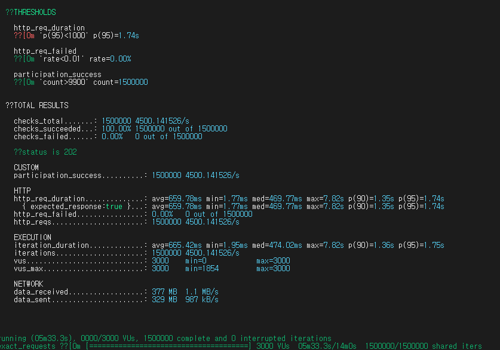
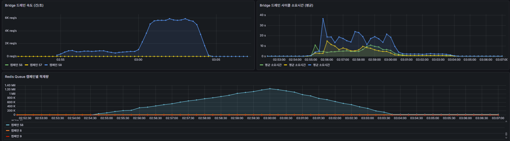
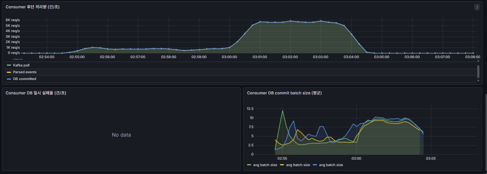

# Reliability Improvements

이 문서는 v3 구조를 유지하면서 관측성, 정합성, 운영 안정성을 보강하기 위한 개선 내용을 정리한다.

## 1. 현재 v3 정합성 경로

현재 핵심 참여 흐름은 다음과 같다.

```text
POST /api/campaigns/{id}/participation
-> ParticipationController
-> ParticipationService
-> RateLimitService
-> RedisStockService
-> check-decr-enqueue.lua
-> Redis 재고 차감 + 순번 확정 + Queue 적재
-> 202 Accepted
-> ParticipationBridge
-> Kafka
-> ParticipationEventConsumer
-> MySQL participation_history INSERT SUCCESS
```

이 구조에서 정합성을 책임지는 핵심은 Redis Lua 스크립트다.

Lua 안에서 다음 작업을 하나의 원자적 실행 단위로 묶는다.

```text
캠페인 활성 여부 확인
-> 중복 참여 여부 확인
-> Queue full 여부 확인
-> 재고 차감
-> 순번 증가
-> Redis Queue 적재
```

따라서 `202 Accepted`는 DB 저장 완료가 아니라, Redis에서 재고 차감과 Queue 적재가 완료되었다는 의미다.

DB 저장은 Bridge, Kafka, Consumer를 통해 비동기로 처리된다.

## 2. 202 이후 후단 처리량 관측

기존 API TPS는 사용자가 `202 Accepted`를 받기까지의 처리량을 보여준다.

하지만 운영 관점에서는 다음 구간도 따로 봐야 한다.

- API TPS: Redis 재고 차감 + Queue 적재 후 `202 Accepted` 응답
- Redis Queue size: API 유입 속도와 Bridge drain 속도의 차이로 누적되는 대기량
- Bridge publish TPS: Redis Queue에서 꺼내 Kafka로 발행한 처리량
- Consumer poll TPS: Kafka Consumer가 실제로 가져온 메시지 수
- Consumer parsed TPS: Consumer가 정상 payload로 해석한 이벤트 수
- DB committed TPS: Consumer가 DB 성공 처리 경로까지 보낸 이벤트 수
- Kafka lag: Kafka에 쌓여 있고 아직 Consumer가 처리하지 못한 메시지 수

이번 개선으로 Consumer에 다음 Micrometer Counter를 추가했다.

```promql
rate(consumer_kafka_records_polled_total[1m])
rate(consumer_events_parsed_total[1m])
rate(consumer_db_committed_total[1m])
rate(consumer_db_transient_failures_total[1m])
```

Bridge 구간은 기존 `bridge_messages_published_total`을 사용한다.

```promql
rate(bridge_messages_published_total[1m])
```

Grafana 대시보드에는 다음 패널을 추가했다.

- `Consumer 후단 처리량 (건/초)`: Kafka poll, parsed events, DB committed TPS 비교
- `Consumer DB 일시 실패율 (건/초)`: DB 장애 등으로 ack를 보류해야 하는 transient failure 감지
- `Consumer DB commit batch size (평균)`: Consumer batch 처리 크기 확인

해석 기준은 다음과 같다.

| 현상 | 해석 |
| --- | --- |
| API TPS는 높은데 Redis Queue가 증가 | Bridge drain 속도가 유입 속도를 못 따라감 |
| Bridge publish TPS는 높은데 Kafka lag 증가 | Consumer 또는 DB 저장 병목 |
| Consumer poll TPS는 높은데 DB committed TPS 낮음 | 파싱 실패, DB 실패, batch insert 병목 가능 |
| DB transient failure 증가 | DB 장애 또는 커넥션 문제로 Kafka ack 보류 가능 |

면접 답변용으로는 이렇게 정리할 수 있다.

> API TPS는 사용자 응답 기준이고, DB까지 완전히 반영된 End-to-End 처리량은 별도로 봐야 한다고 판단했습니다. 그래서 Bridge publish, Consumer poll, DB commit 경로를 분리해서 관측할 수 있도록 Counter를 추가했고, Redis Queue size와 Kafka lag를 함께 보면서 어느 구간이 병목인지 확인할 수 있게 했습니다.

### 2.1 100만/150만 재검증 결과

후단 처리량 지표를 추가한 뒤 같은 shared-iterations 방식으로 100만 건과 150만 건 테스트를 다시 수행했다.

100만 건 테스트에서는 API 평균 처리량이 약 3,154 TPS였고, 후단 DB commit 처리량은 약 2,000 TPS 수준으로 관측됐다. 이 결과를 통해 API가 `202 Accepted`를 반환하는 속도와 실제 DB 저장 완료 속도가 다르다는 점을 확인했다.

150만 건 테스트에서는 후단이 충분히 가속되면서 Bridge/Consumer 후단 처리량이 약 5,500~6,000 TPS까지 상승했다.

| 항목 | 100만 재검증 | 150만 재검증 |
| --- | --- | --- |
| 총 요청 | 1,000,000건 | 1,500,000건 |
| API 평균 TPS | 약 3,154/s | 약 4,500/s |
| 202 성공 | 1,000,000 / 1,000,000 | 1,500,000 / 1,500,000 |
| 5xx 실패 | 0건 | 0건 |
| Redis Queue 최대 적재 | 약 80만 건 | 약 120만 건 |
| 후단 처리량 | 약 2,000/s 수준 | peak 약 5,500~6,000/s |
| 최종 정합성 | successCount 1,000,000 / failCount 0 | successCount 1,500,000 / failCount 0 |







해석은 다음과 같다.

- API TPS는 사용자가 빠르게 접수되는 속도다.
- DB committed TPS는 최종 저장 처리량에 가깝다.
- Redis Queue 적체는 API 유입 속도와 Bridge/Consumer/DB 처리량의 차이로 발생한다.
- shared-iterations 테스트는 대량 spike와 정합성 검증에 적합하다.
- 지속 가능한 처리량은 arrival-rate 테스트와 DB commit TPS를 함께 봐야 한다.

따라서 이번 개선의 핵심은 TPS 숫자를 단순히 높인 것이 아니라, 시스템을 구간별로 나누어 병목을 설명할 수 있게 만든 것이다.

## 3. v1/v2 레거시 실행 코드 정리

현재 v3 구조에서는 API 응답 경로에서 DB를 사용하지 않는다.

따라서 다음 v1/v2 레거시 실행 코드를 제거했다.

| 제거 대상 | 제거 이유 |
| --- | --- |
| `/participation-sync` | DB row lock 방식 성능 비교용 API였고 현재 v3 운영 흐름과 다름 |
| `CampaignRepository.decreaseStockAtomic()` | `/participation-sync`에서만 사용하던 v1 전용 DB 원자 차감 메서드 |
| `PendingRecoveryJobConfig` | v2 PENDING 구조를 전제로 한 복구 Job |
| `BatchScheduler.schedulePendingRecovery()` | 제거된 PENDING 복구 Job 스케줄링 |

이 제거는 v3 정합성에 영향을 주지 않는다.

v3에서는 다음 방식으로 정합성을 유지한다.

- Redis Lua에서 재고 차감과 Queue 적재를 원자화
- Consumer DB 실패 시 Kafka ack 보류
- publish 실패나 잘못된 메시지는 DLQ로 격리
- DLQ 재처리 전 정책적으로 replay/skip/final fail 분류

## 4. Redis Cluster와 Lua 원자성의 한계

현재 Redis 키는 `{campaignId}` 해시태그를 사용한다.

예시:

- `stock:campaign:{1}`
- `total:campaign:{1}`
- `queue:campaign:{1}`
- `participated:campaign:{1}:user:42`
- `active:campaign:{1}`

이유는 Lua 스크립트가 여러 Redis 키를 한 번에 원자적으로 다뤄야 하기 때문이다.

Redis Cluster에서는 Lua 스크립트가 접근하는 키들이 서로 다른 슬롯에 있으면 실행할 수 없다.

그래서 같은 캠페인의 재고 차감, 중복 방지, 순번 확정, Queue 적재를 같은 슬롯으로 묶었다.

이 선택의 장점은 명확하다.

- 하나의 캠페인 안에서 재고 차감과 순번 확정을 원자적으로 처리할 수 있다.
- Kafka 처리 순서가 바뀌어도 Redis에서 이미 비즈니스 순서를 확정할 수 있다.
- 여러 캠페인이 동시에 열리면 캠페인 단위로 슬롯이 나뉘어 분산될 수 있다.

하지만 한계도 있다.

- 단일 대형 캠페인은 하나의 Redis 슬롯/샤드에 집중된다.
- Redis Cluster 전체 노드가 많아도 하나의 캠페인 부하는 여러 샤드로 자연 분산되지 않는다.
- 한 샤드의 CPU, 메모리, 네트워크, Queue 크기가 단일 캠페인의 상한이 된다.

면접 답변용으로는 이렇게 말할 수 있다.

> 단일 캠페인 내부에서는 수평 분산보다 정합성을 우선했습니다. Redis Cluster에서 Lua 원자성을 보장하려면 같은 캠페인의 키를 같은 슬롯에 둬야 했기 때문에 `{campaignId}` 해시태그를 사용했습니다. 대신 이 구조는 하나의 대형 캠페인이 한 샤드에 몰리는 한계가 있습니다. 더 큰 이벤트라면 대기열 시스템이나 bucket 기반 재고 분산 설계를 추가로 검토해야 한다고 봅니다.

## 5. 개선 방향

### 5.1 대기열 시스템

가장 현실적인 개선은 API 앞단에 대기열을 두는 방식이다.

현재 구조는 요청이 들어오면 바로 Redis Lua로 진입한다.

대기열을 두면 한 번에 모든 사용자가 핵심 재고 차감 구간으로 몰리지 않게 만들 수 있다.

기대 효과:

- Redis 단일 슬롯에 순간 부하가 몰리는 문제 완화
- Queue full로 인한 억울한 실패 감소
- 사용자에게 예상 대기 순번/진입 가능 상태 제공 가능
- 안정적인 운영 우선 정책에 적합

주의할 점:

- TPS 자체를 무조건 높이는 방식은 아니다.
- 순간 유입을 평탄화해서 장애 가능성을 낮추는 운영 안정화 전략에 가깝다.
- 최종 DB commit 처리량이 낮으면 대기열 뒤쪽 병목은 여전히 남는다.

### 5.2 Bucket 기반 재고 분산

단일 캠페인의 재고를 여러 bucket으로 나눠 Redis 슬롯을 분산하는 방식이다.

예시:

- `stock:campaign:{1:0}`
- `stock:campaign:{1:1}`
- `stock:campaign:{1:2}`
- `stock:campaign:{1:3}`

사용자는 `userId % bucketCount` 같은 기준으로 bucket에 배정할 수 있다.

기대 효과:

- 단일 캠페인 부하를 여러 Redis 슬롯/샤드로 분산 가능
- 재고 차감 Lua 실행도 bucket 단위로 병렬화 가능

주의할 점:

- 전체 재고를 bucket별로 어떻게 배분할지 정해야 한다.
- 특정 bucket만 먼저 소진되는 편차가 생길 수 있다.
- 전체 순번을 완전히 하나의 증가 sequence로 유지하려면 별도 글로벌 sequence 설계가 필요하다.
- bucket 간 잔여 재고 재조정 로직이 필요할 수 있다.

따라서 현재 프로젝트에서는 바로 적용하기보다 다음 버전의 구조 개선 과제로 두는 것이 적절하다.

### 5.3 Redis Queue에서 Kafka 발행 구간 보강

현재 Bridge는 Redis Queue에서 `RPOP`으로 메시지를 꺼낸 뒤 Kafka로 발행한다.

이 구간에서 Kafka 발행 실패가 발생하면 DLQ로 보내도록 보강되어 있지만, 이상적인 구조는 Redis에서 꺼낸 메시지의 처리 상태를 더 명확히 관리하는 것이다.

추가 개선 후보:

- Redis Streams + Consumer Group
- `RPOPLPUSH` 기반 processing queue
- Outbox 테이블 기반 발행 보장

현재 구조는 성능과 단순성을 우선한 구조이고, 더 강한 전달 보장이 필요하면 처리 중 메시지를 별도 상태로 분리하는 구조가 필요하다.

## 6. 현재 결론

현재 v3 구조는 다음 목표에는 적합하다.

- 사용자 응답 경로에서 DB 제거
- Redis Lua로 재고 차감/중복 방지/순번 확정 원자화
- Kafka로 DB 반영 비동기화
- Consumer ack 보류와 DLQ로 장애 대응
- Grafana 지표로 API, Redis Queue, Bridge, Kafka, DB 흐름 관측
- v1/v2 레거시 실행 코드 제거로 현재 운영 흐름 명확화

다만 다음 한계는 명확하다.

- API TPS와 DB commit TPS는 다른 지표다.
- 단일 캠페인은 Redis Cluster 전체로 자동 분산되지 않는다.
- Bridge drain 속도와 Consumer/DB 처리량이 최종 End-to-End 처리량을 결정한다.
- 대형 이벤트 운영에는 대기열이나 bucket 기반 분산 설계가 추가로 필요하다.
